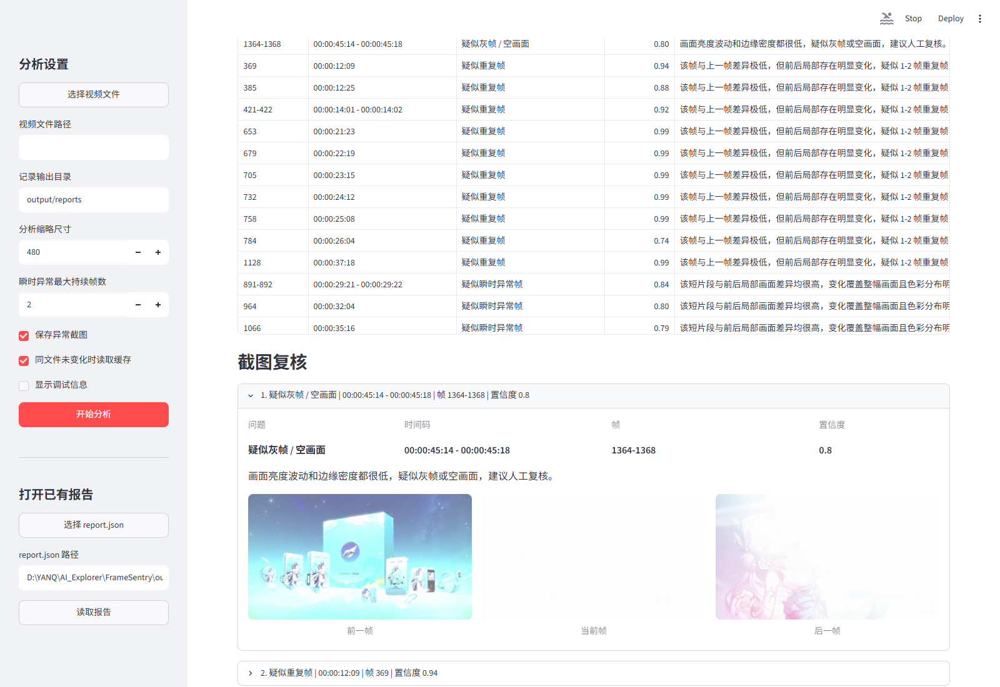

# FrameSentry

FrameSentry 是一个本地视频基础自审工具，用于发现常见规格问题和疑似异常画面，包括黑帧、灰帧 / 空画面、重复帧，以及 1-2 帧瞬时异常帧。

检测结果都以“疑似”形式输出，适合辅助人工复核，不替代最终人工判断。



## 功能

- 通过本地网页选择视频并执行分析
- 按视频文件名生成可识别的报告目录
- 同一视频文件未变化时读取缓存，避免重复分析
- 查看视频基础信息、异常摘要、事件列表和异常截图
- 按最低置信度和异常类型筛选结果
- 支持打开历史 `report.json` 继续复核
- 支持 Windows 文件选择窗口

## 安装

推荐在 Windows 下使用虚拟环境：

```bat
py -3.12 -m venv .venv
.venv\Scripts\python.exe -m pip install -r requirements.txt
```

如果系统安装了 FFmpeg，FrameSentry 会优先使用 `ffprobe` 读取视频基础信息；如果没有，则使用 OpenCV 读取可获得的基础信息。

## 启动前端

推荐直接双击：

```text
run.bat
```

也可以手动启动：

```bat
.venv\Scripts\python.exe -m streamlit run app.py --server.address 127.0.0.1 --server.port 8501
```

启动后打开：

```text
http://127.0.0.1:8501/
```

## 使用流程

1. 点击“选择视频文件”，或手动填写视频文件路径。
2. 确认“保存异常截图”已勾选。
3. 点击“开始分析”。
4. 在“事件概览”中按置信度和异常类型筛选。
5. 在“截图复核”中查看异常前一帧、当前帧和后一帧。

如果同一个视频文件之前已经分析过，并且文件大小、修改时间和分析参数都没有变化，前端会自动读取缓存报告。若缓存报告缺少截图记录，而本次勾选了“保存异常截图”，则会重新分析。

## 报告输出

前端默认只生成用于存储和复查的 JSON 报告，不再生成 `report.html`：

```text
output/reports/视频文件名_时间戳/
  report.json
  screenshots/
```

`report.json` 保留完整检测结果。前端中的置信度和类型筛选只影响当前显示，不会删除原始事件。

## 异常类型

- `疑似黑帧`：画面亮度极低，可能是异常黑场。
- `疑似灰帧 / 空画面`：画面亮度波动和边缘密度都很低，可能是灰帧或空画面。
- `疑似重复帧`：当前帧与上一帧差异极低，但前后局部存在明显变化，可能是 1-2 帧重复。
- `疑似瞬时异常帧`：短片段与前后局部画面差异较高，变化覆盖整幅画面且色彩分布明显不同，可能是异常夹帧或剪辑残留帧。

瞬时异常帧检测会结合全帧差异、局部网格变化覆盖率、颜色直方图差异和左右窗口稳定度，尽量降低局部快速运动或普通镜头切换造成的误报。

## CLI 用法

```bat
.venv\Scripts\python.exe -m framesentry scan input.mp4 --output output/report --save-screenshots --json
```

常用参数：

```text
--sample-scale 480
--max-outlier-frames 2
--fps-normal 25,30,50,60
--save-screenshots
--json
--html
```

CLI 仍保留 `--html` 参数，便于需要静态 HTML 的场景使用；前端分析默认不生成 HTML 报告。

## 测试

运行单元测试：

```bat
.venv\Scripts\python.exe -m unittest discover -s tests
```

运行合成视频端到端检查：

```bat
.venv\Scripts\python.exe tests\synthetic_video_check.py
```
